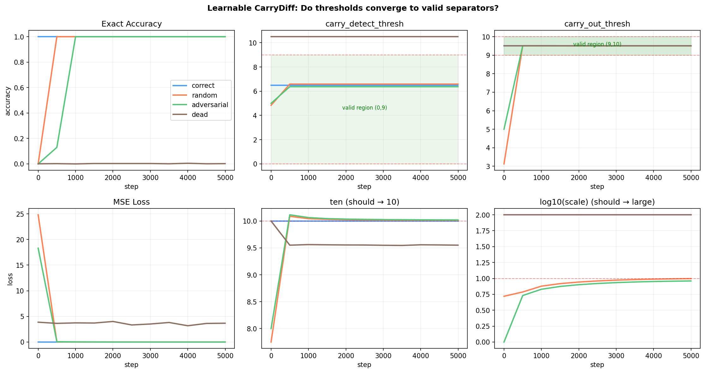

# CarryDiff

A minimal experiment exploring the structure of multi-digit addition: how few parameters does it actually take, and can gradient descent rediscover that structure from scratch?

## Files

### `carrydiff.py` — The Hand-Coded Model

A **4-parameter "model"** that performs 10-digit addition with 100% accuracy. No neural network — no attention, no FFN, no embeddings. Just an iterative carry-propagation algorithm expressed with differentiable primitives (sigmoids instead of if-statements).

**The 4 parameters** are constants of base-10 arithmetic:

| Parameter | Value | Role |
|---|---|---|
| `CARRY_DETECT_THRESH` | 6.5 | Separates "no carry" (0) from "carry" (10) — any value in (0, 9) works |
| `CARRY_OUT_THRESH` | 9.5 | Detects column overflow — any value in (9, 10) works |
| `TEN` | 10.0 | The number base |
| `SCALE` | 1e4 | Sigmoid sharpness — makes it act like a step function |

**How it works:** Takes two 10-digit numbers, computes raw column sums (no carries), then runs 10 iterative carry-propagation steps where each position checks its right neighbor for carries and adjusts. After 10 steps, all carries have propagated.

```bash
python carrydiff.py
```

Runs edge-case tests and a 10,000-sample random accuracy benchmark.

---

### `train_carrydiff.py` — The Learnability Experiment

The interesting question: **if you treat the 4 constants as learnable parameters (initialized to wrong values), does gradient descent rediscover them?**

Tests 4 initialization modes:

| Mode | Starting Point | Result |
|---|---|---|
| `correct` | Known-correct values | Stays at 100% (sanity check) |
| `random` | Random values | ✅ Converges to 100% |
| `adversarial` | Deliberately wrong (cot=5, ten=8) | ✅ Recovers to 100% |
| `dead` | Wrong threshold + high sigmoid sharpness | ❌ **Stuck at 0.2%** — vanishing gradients |

The `dead` mode is the most interesting result: `carry_detect_thresh` starts outside the valid range with a very sharp sigmoid, creating near-zero gradients. It never moves. This is a clean, minimal example of an irrecoverable gradient desert.



```bash
# Run all 4 init modes (~16s on CPU)
python train_carrydiff.py --device cpu --init all

# Run a specific mode
python train_carrydiff.py --device cpu --init adversarial

# Options
python train_carrydiff.py --device cpu --steps 5000 --batch-size 512 --lr 3e-2 --seed 42
```

Outputs a training plot to `results/carrydiff_thresholds/threshold_training.png`.

## Requirements

```
numpy
torch
matplotlib  # optional, for plots
```

## What's the Point?

This isn't a practical addition tool. It's a pedagogical experiment that illustrates:

1. **The cost of learning** — A deterministic task requiring 0 free parameters still costs a neural network hundreds of learned weights. This quantifies the overhead of "not knowing the rules."
2. **Loss landscape geometry** — The learned threshold values aren't unique; they freeze at arbitrary points in a flat valley once the sigmoid saturates.
3. **Gradient failure modes** — The `dead` init mode shows that wrong initialization + sharp nonlinearities can make a problem irrecoverable for gradient descent, even when a human could fix it trivially.
